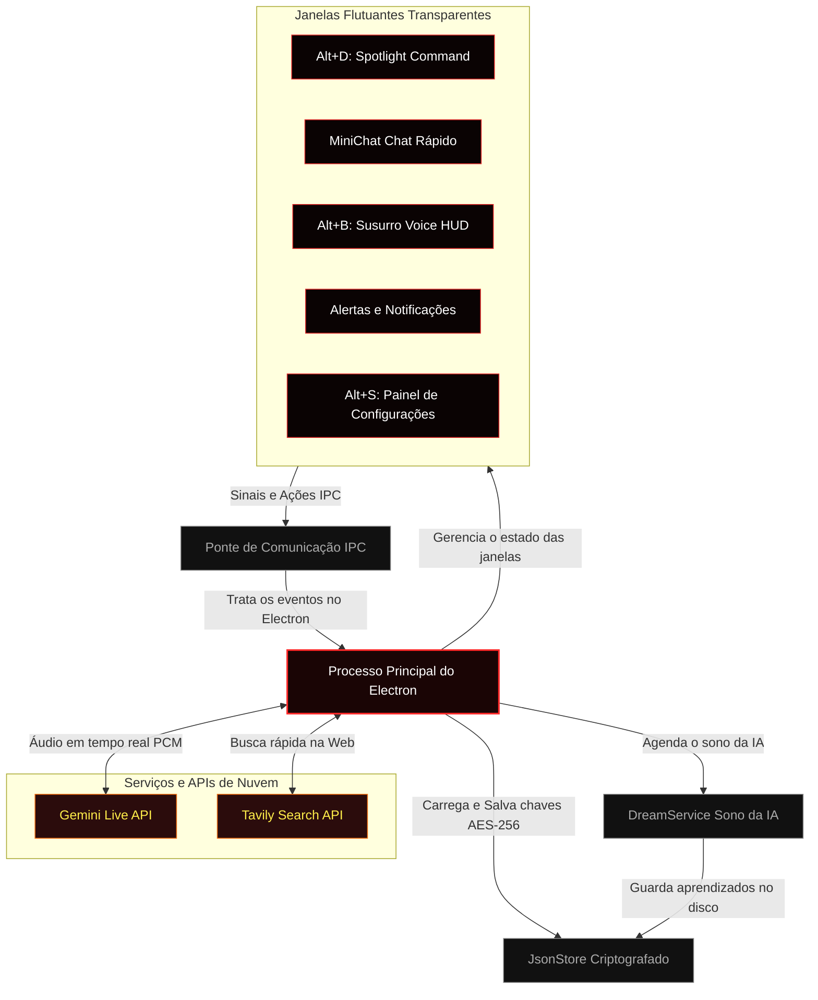

# Hades Agent 🌋

<table>
  <tr>
    <td width="35%" align="center" valign="middle">
      
      
      
      
    </td>
    <td width="65%" valign="top">
      <h1>Hades Agent 🌋</h1>
      <p><strong>O assistente de computador flutuante, superinteligente e invisível que aprende com você!</strong></p>
      <p>Hades Agent é um companheiro de IA ultraleve que vive no seu computador de um jeito totalmente novo. Em vez de ficar preso dentro de uma página de internet comum, ele flutua livremente sobre as suas janelas, ouve e conversa com você em tempo real, faz pesquisas na web em segundos e se esconde automaticamente de qualquer gravação de tela para manter seus dados 100% seguros!</p>
      <p>Desenvolvido usando <strong>Electron</strong>, <strong>React</strong>, <strong>Vite</strong> e a incrível <strong>Gemini Multimodal Live API</strong> do Google, o Hades foi criado para ser extremamente rápido, seguro e inteligente.</p>
    </td>
  </tr>
</table>

---

## ⚡ O que é o Hades? (Explicação Simples!)

Imagine ter um assistente pessoal que é como um super-herói no seu computador:
1. **Ele Ouve e Fala:** Ele não apenas lê textos, ele entende sua voz pelo microfone ou som do sistema instantaneamente.
2. **Ele Tem Memória:** Quando você não está usando o computador, ele entra em um estado de "Sono" (Dreaming) onde analisa as conversas do dia para lembrar de suas preferências e gostos pessoais no futuro.
3. **Ele é Invisível:** Se você estiver transmitindo sua tela no Discord para os amigos, ou gravando um tutorial no OBS, o Hades desaparece magicamente do vídeo! Ninguém verá suas anotações ou chaves secretas.
4. **Super Cofre:** Todas as suas chaves e senhas são salvas usando criptografia de nível bancário direto no seu computador. Sem arquivos `.env` perigosos que podem vazar na internet!

---

## 🚀 Super Recursos & Tecnologias

### 🎙️ Conversa por Voz em Tempo Real (Susurro Voice HUD)
<table>
  <tr>
    <td width="40%" align="center" valign="middle">
      
    </td>
    <td width="60%" valign="top">
      <h4>Como funciona para o usuário:</h4>
      <p>Pressione <code>Alt+B</code> e fale naturalmente! O Hades ouve sua voz e responde de volta falando. Você pode ver um cronômetro e gráficos de quanto está custando a conversa em tempo real.</p>
      <h4>Sob o capô (Técnico):</h4>
      <p>Captura áudio em <strong>16kHz raw PCM</strong> direto do microfone ou áudio do sistema, enviando via <strong>WebSockets</strong> de baixíssima latência para a <code>gemini-2.5-flash-native-audio-latest</code>. Acompanha contagem de tokens e tempo de sessão.</p>
    </td>
  </tr>
</table>

### 🧠 Consolidação de Memórias (Dreaming System)
<table>
  <tr>
    <td width="40%" align="center" valign="middle">
      
    </td>
    <td width="60%" valign="top">
      <h4>Como funciona para o usuário:</h4>
      <p>O Hades tem um "sono artificial". Ele lê os diários das conversas recentes e cria memórias. Você pode escolher qual modelo de inteligência gerencia esse sono e ativar ou desativar essa função nas configurações!</p>
      <h4>Sob o capô (Técnico):</h4>
      <p>O <code>DreamService</code> executa ciclos de análise inteligentes salvando insights consolidados em formato compactado no arquivo local <code>learnings.json</code>. O usuário pode gerenciar o estado da atividade e trocar o modelo dinamicamente na UI de configurações.</p>
    </td>
  </tr>
</table>

### 🕶️ Proteção Antigravação (Stealth Shield)
<table>
  <tr>
    <td width="40%" align="center" valign="middle">
      
    </td>
    <td width="60%" valign="top">
      <h4>Como funciona para o usuário:</h4>
      <p>Ative o "Stealth Mode" (Modo Furtivo) nas configurações. Agora o aplicativo fica totalmente invisível para compartilhamentos de tela do Discord, Teams, gravações do OBS Studio e prints de tela!</p>
      <h4>Sob o capô (Técnico):</h4>
      <p>Aplica a API nativa do sistema operacional <code>setContentProtection(true)</code> em todas as janelas do Electron, impedindo capturas de tela no nível de composição de janelas do Windows (DWM).</p>
    </td>
  </tr>
</table>

### ⌨️ Barra de Pesquisa Rápida (Spotlight Command Bar)
<table>
  <tr>
    <td width="40%" align="center" valign="middle">
      
    </td>
    <td width="60%" valign="top">
      <h4>Como funciona para o usuário:</h4>
      <p>Aperte <code>Alt+D</code> para abrir uma barra de comandos no estilo macOS Spotlight. Digite sua dúvida e o Hades pesquisará em tempo real na internet para te dar uma resposta super completa em formato markdown.</p>
      <h4>Sob o capô (Técnico):</h4>
      <p>Envia requisições assíncronas para a **Tavily Search API**, processando dados estruturados de busca em tempo real com renderização reativa em janelas transparentes do Electron.</p>
    </td>
  </tr>
</table>

### 🔒 Chaves Criptografadas (Sem arquivos .env expostos!)
<table>
  <tr>
    <td width="40%" align="center" valign="middle">
      
    </td>
    <td width="60%" valign="top">
      <h4>Como funciona para o usuário:</h4>
      <p>Você não precisa editar arquivos de texto complexos. Basta abrir a interface de Configurações (<code>Alt+S</code>), colar suas chaves de API do Google Gemini e Tavily, e pronto! Tudo é salvo criptografado de forma segura no seu disco.</p>
      <h4>Sob o capô (Técnico):</h4>
      <p>Utiliza um wrapper seguro de criptografia simétrica <strong>AES-256-CBC</strong> com chaves derivadas por <strong>scrypt</strong> a nível de usuário (baseado no usuário do SO). As chaves nunca são expostas em texto puro em arquivos de configuração.</p>
    </td>
  </tr>
</table>

---

## 🚀 Como Instalar o Hades Agent

### 📦 Opção 1: Para Usuários (Instalação Direta e Rápida)
Se você quer apenas utilizar o Hades Agent no seu dia a dia, siga o método oficial simplificado:

1. Acesse a barra lateral direita desta página do GitHub e clique em **[Releases](https://github.com/victorl-dev/Hades-Agent/releases)**.
2. Baixe o instalador executável oficial do Windows (exemplo: `Hades-Setup-1.1.0.exe`).
3. Dê dois cliques no instalador baixado para instalar e abrir o aplicativo instantaneamente!
4. Com o aplicativo aberto, aperte **`Alt+S`** no teclado para acessar a aba de Configurações, insira suas chaves do Gemini e Tavily, clique em **Salvar** e aproveite!

---

### 🛠️ Opção 2: Para Desenvolvedores (Código Fonte)
Se você deseja rodar a aplicação em modo de desenvolvimento, contribuir com o código fonte ou depurar a aplicação localmente:

1. Certifique-se de ter o **[Node.js](https://nodejs.org/)** instalado em sua máquina.
2. Clone o repositório e navegue até a pasta do projeto:
   ```powershell
   git clone https://github.com/victorl-dev/Hades-Agent.git
   cd Hades-Agent
   ```
3. Instale todas as dependências locais de desenvolvimento:
   ```powershell
   npm install
   ```
4. Rode a aplicação em ambiente de testes/desenvolvimento concorrente:
   ```powershell
   npm run dev
   ```
5. Acesse as Configurações pelo atalho **`Alt+S`** no aplicativo para inserir as suas credenciais do **Google AI Studio** e **Tavily**. Elas serão salvas criptografadas automaticamente na pasta de dados local do seu sistema, sem risco de vazamentos!

---

## ⚙️ Teclas de Atalho Padrão

O Hades fica quietinho na bandeja do sistema (perto do relógio do Windows) e pode ser ativado a qualquer momento usando estas teclas mágicas:

*   **`Alt+D`** ➔ Abre a Barra de Pesquisa Rápida (Spotlight).
*   **`Alt+B`** ➔ Abre o Gravador de Voz Interativo (Susurro).
*   **`Alt+S`** ➔ Abre o Painel de Configurações e Atalhos.
*   **`Esc`** ➔ Fecha ou esconde qualquer painel ativo e devolve o foco para a sua janela anterior.

> [!NOTE]
> Você pode personalizar todas essas teclas na aba **Teclas de Atalho** dentro do painel de Configurações!

---

## 🏗️ Arquitetura do Sistema

O Hades se comunica usando eventos IPC rápidos entre as janelas transparentes do Electron e os serviços de inteligência na nuvem:



---

## 💡 Inspiração e Agradecimentos (Inspirado no Persua)

> [!NOTE]
> ### 🌟 Reconhecimento Especial a Lucas Montano (@lucasmontano)
> 
> Este projeto foi inspirado no conceito brilhante do **Persua**, um assistente de voz e IA em tempo real criado e demonstrado pelo renomado engenheiro e criador de conteúdo **Lucas Montano** (@lucasmontano)!
> 
> **Gostaríamos de frisar e deixar claro que nenhum código do Persua foi copiado ou utilizado.** O **Hades Agent** foi desenvolvido inteiramente do zero por nós para fins de portfólio de engenharia técnica, permitindo explorar a fundo temas complexos como streams de áudio PCM brutos, conexão por WebSockets com o Gemini Live, e criptografia segura de chaves API no Electron.
> 
> Agradecemos ao **Lucas Montano** por inspirar a comunidade de tecnologia e elevar o patamar no desenvolvimento de projetos criativos! 🚀

---

## 🤝 Como Contribuir

Quer ajudar a melhorar o Hades? Ficaremos super felizes!

1.  **Mantenha o código limpo:** Mantenha os hooks em React com menos de 300 linhas de código.
2.  **Use a Single Source of Truth:** Salve as configurações sempre usando o `electron/store/jsonStore.js`.
3.  **Mantenha a estética premium:** Use o design de vidro jateado (glassmorphism) do Hades definido no arquivo `src/styles/`.

---

## 📄 Licença

Este projeto é licenciado sob a licença **MIT** — sinta-se livre para usar, estudar e modificar o código como quiser!
