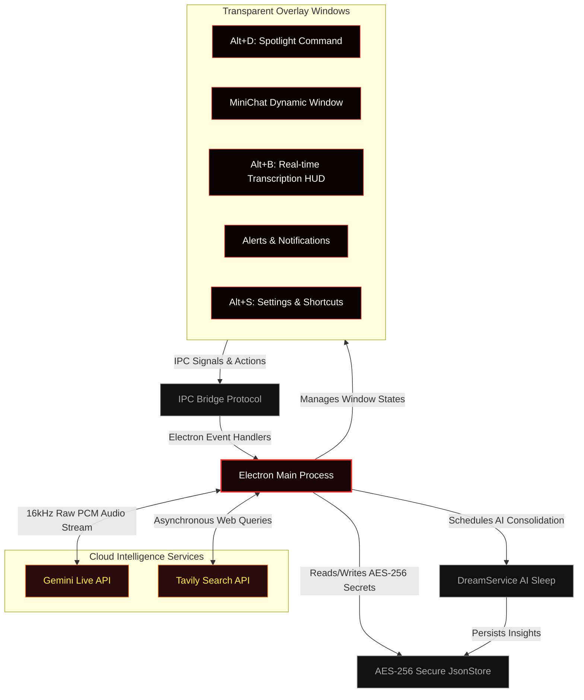

<p align="center">
  
</p>

<table>
  <tr>
    <td width="35%" align="center" valign="top">
      
      <p align="center" style="margin-top: 10px; margin-bottom: 0;">
        
        
        
      </p>
    </td>
    <td width="65%" valign="top" style="padding-left: 20px;">
      <h1 style="margin-top: 0; margin-bottom: 8px;">Hades Agent </h1>
      <p><strong>Hades is an invisible, ultra-fast desktop companion with autonomous background memory consolidation and a local task scheduler.</strong></p>
      <p><strong>Safety Limits:</strong> Sandboxed with <strong>zero system-write access</strong> (cannot create, edit, or delete files, nor run scripts). The AI is strictly restricted to real-time Google queries (via Tavily) and local memory logs, keeping your PC 100% safe.</p>
    </td>
  </tr>
</table>

<p align="center" style="margin-top: 20px;">
  <a href="https://github.com/victorl-dev/Hades-Agent/releases"></a>
  <a href="https://github.com/victorl-dev/Hades-Agent/blob/master/LICENSE"></a>
  <a href="https://github.com/victorl-dev/Hades-Agent"></a>
  <a href="https://github.com/victorl-dev/Hades-Agent"></a>
</p>

<table>
<tr>
  <td><b>🛡️ Anti-Recording Shield</b></td>
  <td>Native OS-level content protection via <code>setContentProtection</code>. Hades becomes <strong>completely invisible</strong> to OBS Studio, Discord, Teams, Zoom, and all Windows screen-capture APIs — your private data never leaks through shared screens.</td>
</tr>
<tr>
  <td><b>🎙️ Real-time Transcription (Alt+B)</b></td>
  <td>Press <code>Alt+B</code> to capture and transcribe PC internal audio (like meetings or video classes) in real-time. Streams raw <strong>16 kHz PCM audio</strong> over a full-duplex WebSocket directly to the <strong>Gemini Live API</strong>, achieving sub-100ms transcription latency.</td>
</tr>
<tr>
  <td><b>⚡ Spotlight Command Bar</b></td>
  <td>Press <code>Alt+D</code> to summon a floating, borderless command bar. Delivers <strong>real-time internet-grounded answers</strong> powered by the Tavily Search API — attach images, switch AI models, and get answers without ever leaving your workflow.</td>
</tr>
<tr>
  <td><b>💬 Session MiniChat</b></td>
  <td>A persistent chat HUD that displays the <strong>active model, live token count, and session cost</strong>. Wipe the session instantly to reset all timers, history, and spend back to zero — no restart required.</td>
</tr>
<tr>
  <td><b>🧠 Dream Memory Consolidation</b></td>
  <td>Scheduled background AI cycles synthesize recent session logs into a <strong>compressed <code>learnings.json</code> memory profile</strong> — similar to how the brain consolidates long-term memory during sleep. Runs fully offline.</td>
</tr>
<tr>
  <td><b>📋 Safe Task Scheduler</b></td>
  <td>A strictly sandboxed, <strong>offline task ledger</strong> with zero system-write permissions. Safely schedule automated web searches, create daily reminders, and organize MiniChat responses without risking modifications to your local files. Managed through encrypted IPC database handlers.</td>
</tr>
</table>

---

##  Getting Started

### For Users (Download Installer)

1. Head to the **[Releases](https://github.com/victorl-dev/Hades-Agent/releases)** page.
2. Download **`Hades-Agent-Setup-1.0.0.exe`** (or the `.zip` portable version).
3. Run the installer, launch Hades, then press **`Alt+S`** to enter your API keys.

> [!WARNING]
> **Platform:** Hades has been tested exclusively on **Windows 10**. Windows 11 may work but is untested. macOS and Linux are **not supported** — the Anti-Recording Shield (`setContentProtection`) and global hotkey registration rely on Windows-specific Electron APIs.

> [!IMPORTANT]
> Hades requires two free API keys to operate:
> - **[Google Gemini API Key](https://aistudio.google.com/app/apikey)** — for all AI inference and voice streaming.
> - **[Tavily Search API Key](https://app.tavily.com/)** — for real-time web search grounding.

### For Developers (Build from Source)

**Prerequisites**

| Requirement | Version | Notes |
| :--- | :--- | :--- |
| [Node.js](https://nodejs.org/) | v18.x or newer | LTS recommended |
| npm | bundled with Node.js | — |
| Windows | 10 / 11 | `setContentProtection` is Windows-only |

```bash
# 1. Clone the repository
git clone https://github.com/victorl-dev/Hades-Agent.git
cd Hades-Agent

# 2. Install all dependencies
npm install

# 3. Launch the concurrent hot-reload dev environment
npm run dev
```

The dev server starts Vite (React renderer on `:3000`) and Electron concurrently with full hot-reload on both sides.

---

##  Keyboard Shortcuts

Hades lives silently in your system tray and can be summoned from any application, at any time:

| Shortcut | Action |
| :--- | :--- |
| **`Alt+D`** | Summon / dismiss the Spotlight Command Bar |
| **`Alt+B`** | Summon / dismiss the Real-time Transcription HUD |
| **`Alt+S`** | Open Settings & Shortcut Customization |
| **`Alt+V`** | Toggle voice input mode |
| **`Esc`** | Hide the active window and restore prior focus |

> [!TIP]
> Every shortcut is fully rebindable. Open the **Shortcuts** tab inside Settings (`Alt+S`) to assign your own key combinations.

---

##  System Architecture

Hades orchestrates multiple transparent overlay windows through a strict **IPC event bridge**, keeping the renderer completely sandboxed from the filesystem while the main process handles all privileged operations:



---

##  AI-Assisted Engineering

Hades was co-engineered with **[Google Antigravity](https://deepmind.google/)** (Advanced Agentic Coding Assistant by Google DeepMind) using **Subagent-Driven Development (SDD)**:

- **Modular Autonomy:** Specialized subagents independently built IPC event engines, AES-256 cryptography wrappers, voice PCM pipelines, and window lifecycle managers — each validated in isolation before integration.
- **Strict Quality Gates:** Architecture enforces minimal custom React hook sizes, a single centralized state store (`jsonStore.js`), and production Vite compilation times consistently under **760 ms**.
- **Continuous Hardening:** Security subagents enforced sandbox isolation, Content Security Policy headers, and `contextIsolation` at every IPC boundary, with no `nodeIntegration` exposure to the renderer.

---

##  Inspiration & Credits

> [!NOTE]
> Hades Agent is inspired by **Persua**, a conceptual real-time voice and AI assistant created by software engineer **Lucas Montano** ([@lucasmontano](https://github.com/lucasmontano)). Hades was engineered entirely from scratch to explore raw PCM streaming, full-duplex WebSockets, and OS-level content-protection algorithms in Electron. Thank you, Lucas, for pushing the community to build things that don't exist yet.

---

##  Star History

<a href="https://www.star-history.com/?repos=victorl-dev%2Fhades-agent&type=date&legend=top-left">
 <picture>
   <source media="(prefers-color-scheme: dark)" srcset="https://api.star-history.com/chart?repos=victorl-dev/hades-agent&type=date&theme=dark&legend=top-left" />
   <source media="(prefers-color-scheme: light)" srcset="https://api.star-history.com/chart?repos=victorl-dev/hades-agent&type=date&legend=top-left" />
   
 </picture>
</a>

---

##  License

MIT — See [LICENSE](LICENSE).

Built with dedication by [Victor L.](https://github.com/victorl-dev)

