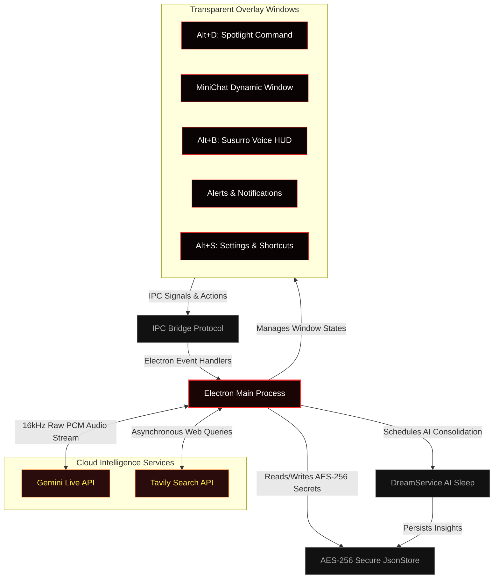

# Hades Agent 

<table>
  <tr>
    <td width="35%" align="center" valign="middle">
      
      
      
      
    </td>
    <td width="65%" valign="top">
      <h1>Hades Agent </h1>
      <p><strong>The floating, super-smart, and invisible desktop AI assistant that learns from you!</strong></p>
      <p>Hades Agent is an ultra-lightweight AI companion that lives on your computer in an entirely new way. Instead of being stuck inside a browser tab, it floats freely over your open windows, listens and talks to you in real-time, searches the web in seconds, and automatically hides from screen recordings to keep your data 100% safe!</p>
      <p>Built with <strong>Electron</strong>, <strong>React</strong>, <strong>Vite</strong>, and powered by Google's cutting-edge <strong>Gemini Multimodal Live API</strong>, Hades is engineered to be extremely fast, secure, and smart.</p>
    </td>
  </tr>
</table>

---

## ⚡ What is Hades? (In Simple Words!)

Imagine having a personal assistant who is like a superhero on your computer:
1. **It Listens and Speaks:** It doesn't just read text; it understands your voice through your microphone or system audio instantly.
2. **It Has Memory:** When you aren't actively using your computer, it enters an "AI Sleep" (Dreaming) state where it analyzes the day's conversations to remember your preferences and tastes for the future.
3. **It is Invisible:** If you are sharing your screen on Discord, Microsoft Teams, recording a video with OBS Studio, or taking screenshots, Hades magically disappears from the video stream! No one will ever see your notes or secret keys.
4. **Super Vault:** All your secret API keys and configurations are saved using bank-grade encryption directly on your machine. No dangerous `.env` files that can leak on the internet!

---

## 🚀 Core Features & Technology Stack

### 🎙️ Real-Time Voice Chat (Susurro Voice HUD)
*   **For Users:** Press `Alt+B` and speak naturally! Hades hears your voice and speaks back to you in real-time. You can see a live timer, session cost trackers, and dynamic audio wave visualizers.
*   **Technical Details:** Captures **16kHz raw PCM audio** directly from your microphone or system audio stream, transmitting it via ultra-low latency **WebSockets** to Google's `gemini-2.5-flash-native-audio-latest` model.

### 🧠 Memory Consolidation (Dreaming System)
*   **For Users:** Hades has an "artificial sleep." It reads recent chat history files to form memories of who you are. You can choose which model manages this sleep and enable or disable this function in the settings panel.
*   **Technical Details:** The `DreamService` schedules background analysis cycles, synthesizing and storing consolidated user insights in a highly compressed format in a local `learnings.json` file.

### 🕶️ Anti-Recording Shield (Stealth Shield)
*   **For Users:** Enable "Stealth Mode" in your settings. Hades instantly becomes completely invisible to screen shares (Discord, Zoom, Teams), video recordings (OBS Studio, Camtasia), and OS-level screenshots!
*   **Technical Details:** Applies the OS-level `setContentProtection(true)` API on all Electron windows, blocking screen capture at the Windows Desktop Window Manager (DWM) composition level.

### ⌨️ Quick-Search Bar (Spotlight Command Bar)
*   **For Users:** Press `Alt+D` to open a search bar in the style of macOS Spotlight. Type any question, and Hades will search the internet in real-time to render highly detailed markdown answers.
*   **Technical Details:** Sends asynchronous queries to the **Tavily Search API**, processing and rendering live search results dynamically inside transparent, reactive overlay windows.

### 🔒 Bank-Grade Encrypted Storage (Zero .env Leaks!)
*   **For Users:** No complex configuration files to edit. Just open the Settings panel (`Alt+S`), paste your Google Gemini and Tavily API keys, and click **Save**. Hades secures them with strong encryption instantly.
*   **Technical Details:** Uses a secure symmetric encryption wrapper powered by **AES-256-CBC** with keys derived using **scrypt** based on your OS username. Secret keys are never stored in plain text.

### 📋 Task Management (To-Do & Reminders)
*   **For Users:** Schedule and list your daily tasks and quick reminders directly inside Hades! Keep your workflow organized without needing external notebook apps.
*   **Technical Details:** Implemented through custom IPC task handlers that serialize and persist task structures to a secure, locally encrypted database file managed by `jsonStore.js`.
*   **⚠️ Current Task Limitations:**
    *   **Local Storage Only:** All tasks are kept fully offline on your own machine. There is no cloud sync, meaning your tasks never leave your computer.
    *   **No Active OS Notifications:** Currently, the scheduler acts as a lightning-fast interactive to-do ledger. It does not issue system-level audio alarms or desktop push notifications when a task's target time is reached.
    *   **No Automated Actions:** Scheduled tasks do not trigger active shell commands, scripts, or automated web browsing actions.

---

## 🤖 AI-Assisted Architecture & Engineering

Hades Agent represents a landmark in modern **AI-assisted software engineering**. The entire repository was co-engineered with Google's **Antigravity** (Advanced Agentic Coding Assistant by Google DeepMind) using a formal, highly disciplined development paradigm:

*   **Subagent-Driven Development (SDD):** The architecture was built through a multi-layered, autonomous workflow where specialized subagents tackled atomic modules (IPC orchestration, cryptocores, real-time voice, and UI layouts) while executing continuous validation cycles.
*   **Strict Quality & Optimization Gates:** Enforced clean code principles—preventing spaghetti hooks, maintaining strict TypeScript typings, applying centralized State Management via a single source of truth (`jsonStore.js`), and optimizing production bundles to compile in under **760ms**.
*   **Zero-Overhead Security Auditing:** Automatically scanned and expunged development configurations (`opencode.json`, `.planning/`, `.env`) physically and historically from the entire Git tree to ensure production-grade security.

---

## 🚀 How to Install & Run Hades Agent

### 📦 Option 1: For Users (Quick Stable Install)
If you want to use Hades Agent in your daily life, follow this simple path:

1. Go to the right sidebar of this GitHub page and click on **[Releases](https://github.com/victorl-dev/Hades-Agent/releases)**.
2. Download the latest official Windows installer (e.g., `Hades-Setup-1.0.0.exe`).
3. Double-click the installer to install and launch the application instantly.
4. Press **`Alt+S`** to open the Settings panel, paste your Gemini and Tavily API keys, click **Save**, and start talking to Hades!

---

### 🛠️ Option 2: For Developers (Source Code)
If you want to run the code locally, debug, or contribute:

1. Make sure you have **[Node.js](https://nodejs.org/)** (v18.x or newer) installed.
2. Clone the repository and navigate to the directory:
   ```bash
   git clone https://github.com/victorl-dev/Hades-Agent.git
   cd Hades-Agent
   ```
3. Install all workspace development dependencies:
   ```bash
   npm install
   ```
4. Start the concurrent development environment:
   ```bash
   npm run dev
   ```
5. Press **`Alt+S`** inside the app to save your API keys. They will be encrypted securely in your local app data directory.

---

## ⚙️ Keyboard Shortcuts

Hades stays quietly in your system tray (near the Windows clock) and can be summoned instantly using these shortcut keys:

*   **`Alt+D`** ➔ Open the Spotlight Command Bar.
*   **`Alt+B`** ➔ Open the Susurro Voice HUD recorder.
*   **`Alt+S`** ➔ Open the Settings & Shortcuts panel.
*   **`Esc`** ➔ Hide the active window and return focus to your previous application.

> [!TIP]
> You can fully customize all of these shortcut keys inside the **Shortcuts** tab in the Settings panel!

---

## 🏗️ System Architecture

Hades uses fast IPC events to communicate between transparent overlay windows and cloud intelligence services:



---

## 💡 Inspiration & Credits (Inspired by Persua)

> [!NOTE]
> ### 🌟 Special Acknowledgement to Lucas Montano (@lucasmontano)
> 
> This project was inspired by the brilliant concept of **Persua**, a real-time voice and AI assistant created and demonstrated by the renowned software engineer and content creator **Lucas Montano** (@lucasmontano)!
> 
> **We want to emphasize that no code from Persua was copied or used in this repository.** **Hades Agent** was developed entirely from scratch as a technical engineering portfolio project. This allowed us to explore advanced concepts such as raw PCM audio streaming, full-duplex WebSockets with Gemini Live, and native secure encryption algorithms in Electron.
> 
> Thank you, **Lucas Montano**, for inspiring the technology community and raising the bar for creative project development! 🚀

---

## 🤝 Contributing

We welcome contributions to make Hades Agent even better! Please keep these core rules in mind:

1. **Keep it Modular:** Ensure all React custom hooks are kept under 300 lines of code.
2. **Single Source of Truth:** Read and write configurations exclusively through `electron/store/jsonStore.js`.
3. **Premium Visuals:** Preserve the custom frosted-glass (glassmorphism) aesthetics defined in `src/styles/`.

---

## 📄 License

This project is licensed under the **MIT License** — feel free to study, modify, and build upon it as you wish!
