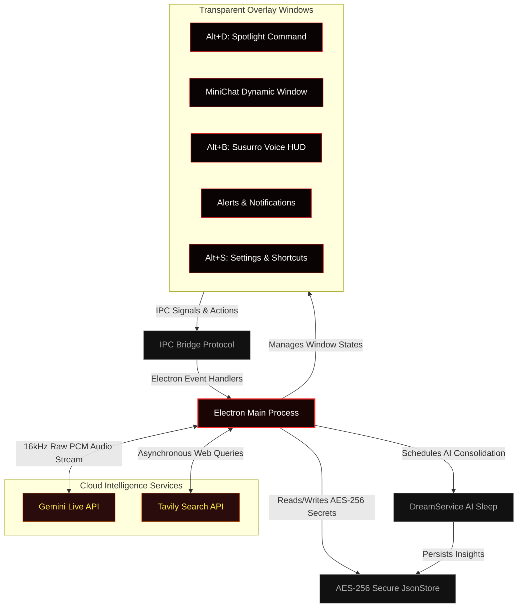

<p align="center">
  
</p>

<table>
  <tr>
    <td width="35%" align="center" valign="middle">
      
      <p align="center" style="margin-top: 12px; margin-bottom: 0;">
        
        
        
      </p>
    </td>
    <td width="65%" valign="top">
      <h1>Hades Agent </h1>
      <p><strong>Hades Agent: An invisible, ultra-fast desktop AI companion built with Electron and Gemini Live API. Featuring real-time voice streaming, a native Stealth Mode (invisible to OBS/screen-shares), lightning-fast web search, plus background memory dreaming.</strong></p>
      <p>Hades Agent is an ultra-lightweight AI companion that lives on your computer in an entirely new way. Instead of being stuck inside a browser tab, it floats freely over your open windows, listens and talks to you in real-time, searches the web in seconds, and automatically hides from screen recordings to keep your data 100% safe!</p>
      <p>Built with <strong>Electron</strong>, <strong>React</strong>, <strong>Vite</strong>, and powered by Google's cutting-edge <strong>Gemini Multimodal Live API</strong>, Hades is engineered to be extremely fast, responsive, and smart.</p>
    </td>
  </tr>
</table>

<p align="center" style="margin-top: 20px;">
  <a href="https://github.com/victorl-dev/Hades-Agent/releases"></a>
  <a href="https://github.com/victorl-dev/Hades-Agent/blob/master/LICENSE"></a>
  <a href="https://github.com/victorl-dev/Hades-Agent"></a>
  <a href="https://github.com/victorl-dev/Hades-Agent"></a>
</p>

<table>
<tr><td><b>Anti-Recording Shield</b></td><td>Native OS-level content protection. Hades magically becomes completely invisible on OBS Studio, Discord, Teams, Zoom screen-shares, and Windows screenshots to prevent private data leaks.</td></tr>
<tr><td><b>Voice HUD (Susurro)</b></td><td>Press <code>Alt+B</code> to talk naturally. Direct 16kHz raw PCM streaming via ultra-low latency WebSockets directly to Google's Gemini Live API with sub-100ms response times.</td></tr>
<tr><td><b>Spotlight Command Bar</b></td><td>Press <code>Alt+D</code> to summon a floating, transparent search bar. Get real-time internet-enabled answers instantly powered by the Tavily Search API.</td></tr>
<tr><td><b>Session-Specific MiniChat</b></td><td>Dynamic chat HUD showing active model specs and token consumption in real-time. Wipe your session instantly to reset timers, history, and usage cost back to zero.</td></tr>
<tr><td><b>Memory dreaming consolidation</b></td><td>Offline artificial sleep schedules background cycles to synthesize recent logs, automatically updating your highly compressed local <code>learnings.json</code> memory profile.</td></tr>
<tr><td><b>Task & Reminder scheduler</b></td><td>Offline to-do ledger managed through secure IPC database handlers to schedule and monitor daily tasks fully local and offline.</td></tr>
</table>

---

##  Getting Started

### For Users (Download Installer)
1. Head to the **[Releases](https://github.com/victorl-dev/Hades-Agent/releases)** page.
2. Download the latest official Windows installer (`Hades-Setup-X.Y.Z.exe`).
3. Launch the app, press **`Alt+S`** inside the app to save your API keys, and start chatting!

### For Developers (Build from Source)
Make sure you have **[Node.js](https://nodejs.org/)** (v18.x or newer) installed. Then run:

```bash
# Clone the repository
git clone https://github.com/victorl-dev/Hades-Agent.git
cd Hades-Agent

# Install workspace dependencies
npm install

# Start the concurrent hot-reload development process
npm run dev
```

---

##  Keyboard Shortcuts

Hades floats quietly over your desktop and can be summoned instantly from anywhere:

| Shortcut | Action |
| :--- | :--- |
| **`Alt+D`** | Summon Spotlight Command Bar |
| **`Alt+B`** | Summon Susurro Voice HUD |
| **`Alt+S`** | Open Settings & Shortcut Customization |
| **`Esc`** | Instantly hide active window and restore focus |

> [!TIP]
> You can fully customize all hotkeys inside the **Shortcuts** tab in the Settings panel (`Alt+S`)!

---

##  System Architecture

Hades orchestrates transparent renderer overlay windows and backend security pipelines using high-speed IPC event protocols:



---

##  AI-Assisted Engineering

Hades Agent was co-engineered with Google's **Antigravity** (Advanced Agentic Coding Assistant by Google DeepMind) using **Subagent-Driven Development (SDD)**:
- **Modular Autonomy:** Specialized subagents built individual IPC event engines, cryptography wrappers, and voice pipelines under high-speed validation loops.
- **Strict Quality Constraints:** Clean code architecture keeping custom React hook sizes minimal, utilizing a centralized State Store (`jsonStore.js`), and keeping production compilation times under **760ms**.

---

##  Inspiration & Credits

> [!NOTE]
> Hades Agent is inspired by **Persua**, a conceptual real-time voice and AI assistant created by software engineer **Lucas Montano** (@lucasmontano). Hades was engineered entirely from scratch to explore raw PCM streaming, full-duplex WebSockets, and content-protection algorithms in Electron. Thank you, Lucas, for inspiring the community! 🚀

---

##  Star History

[](https://star-history.com/#victorl-dev/Hades-Agent&Date)

---

##  License

MIT — See [LICENSE](LICENSE).

Built with 🖤 by [Victor L.](https://github.com/victorl-dev)
