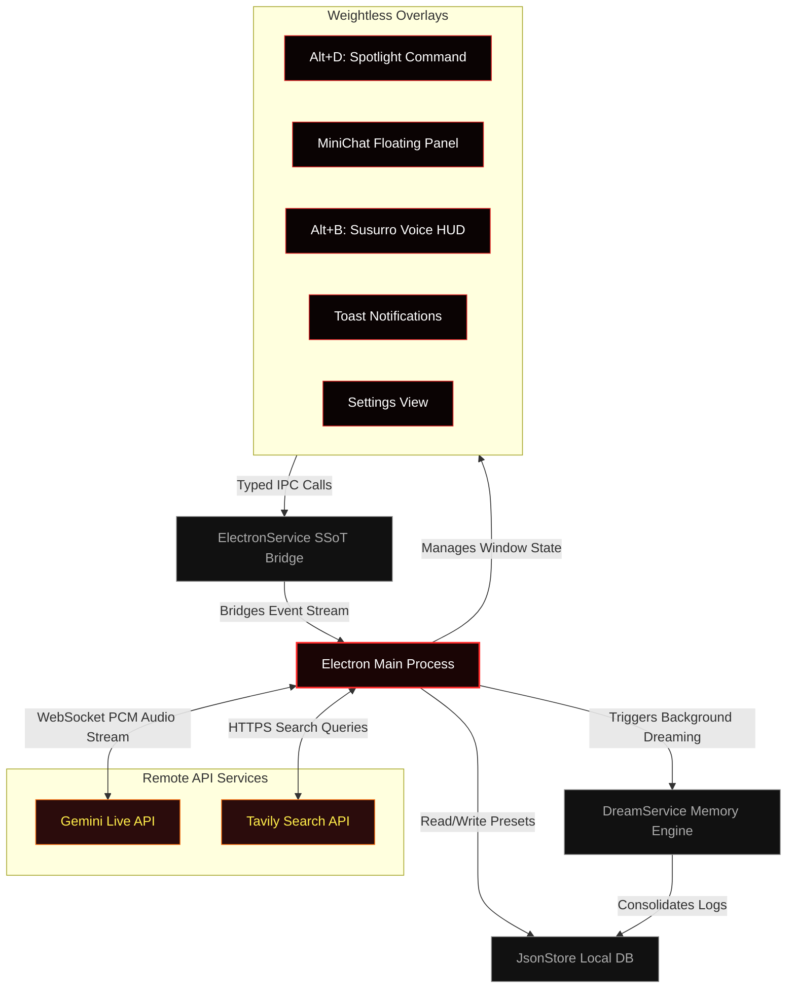

# Hades Agent 🌋

<p align="center">
  
</p>

<p align="center">
  <strong>The weightless, self-improving spatial desktop AI agent. Built on Electron, React, and Google's Gemini Multimodal Live API.</strong>
</p>

<p align="center">
  
  
  
  
  
</p>

---

## ⚡ Introduction

**Hades Agent** is a weightless, highly spatial, and deeply integrated desktop AI companion designed to live natively on your operating system. Unlike conventional flat web apps, Hades floats weightlessly over your active windows, offering real-time native audio transcription, immediate web search compilation, background consolidation of memories, and total privacy masking.

Run it seamlessly in the background of your OS, summon it with global hotkeys, and watch it consolidate behavioral memories during idle times.

---

## 🚀 Bento Feature Grid

| Feature | Capabilities |
| :--- | :--- |
| **🎙️ A Real Voice & Spatial HUD** | Activated via `Alt+B`. Streams real-time native audio (microphone or system) at **16kHz raw PCM** over WebSockets to the **Gemini Multimodal Live API** (`gemini-2.5-flash-native-audio-latest`). Features modular telemetry checking, runtime token cost analysis, and active session timers. |
| **🌍 Live Translation Layer** | Integrated background worker processes translation requests, translating voice transcriptions in real-time into the language configured in your Settings dashboard. |
| **🧠 Closed Learning Loop** | Driven by **DreamService**. When Hades goes idle or 10s after startup, it enters a "Dream Cycle" to read past session logs, extract behavioral preferences, and consolidate insights into `.Hades/memory/learnings.json` for long-term memory. |
| **🕶️ Hardware-Level Stealth Shield** | Integrates OS composite masking (`setContentProtection`). Hades is completely invisible to screen captures, Discord streams, OBS, and recording tools—guaranteeing 100% privacy for your keys, terminals, and workspace data. |
| **⌨️ Spotlight Command Bar** | Summons via `Alt+D`. Captures immediate keyboard prompts, queries the **Tavily Search API** for live web intelligence, and renders beautifully structured markdown synthesis instantly on screen. |
| **🎭 Persistent Persona Manager** | Create, configure, and save customized AI personas with specific system prompts, loaded dynamically from your local database store. |
| **🕒 Task & Notification Daemon** | Background task runner checking schedules every 30 seconds, spawning lightweight transparent notification overlays without breaking window focus. |

---

## 🛠️ Quick Install

### Windows (Native, PowerShell) & Node Environment

Ensure you have [Node.js](https://nodejs.org/) (v18.x or newer) and Git installed on your system.

Run the following commands in your terminal to set up and launch Hades Agent:

```powershell
# 1. Clone the repository
git clone https://github.com/victorl-dev/Hades-Agent.git
cd Hades-Agent

# 2. Install workspace dependencies
npm install

# 3. Setup configuration variables
cp .env.example .env

# 4. Launch in concurrent Development Mode
npm run dev
```

> [!IMPORTANT]
> Make sure to open your newly created `.env` file and insert your API credentials:
> ```env
> VITE_GEMINI_API_KEY=your_gemini_api_key_here
> VITE_TAVILY_API_KEY=your_tavily_api_key_here
> ```

---

## ⚙️ Getting Started & Commands

Hades Agent remains quiet in your system tray and is summoned via global desktop hotkeys:

*   **`Alt+D`** ➔ Summon Spotlight Command Launcher (Web-Search + AI synthesis).
*   **`Alt+B`** ➔ Open and toggle real-time audio voice transcription in **Susurro Voice HUD**.
*   **`Esc`** ➔ Instantly stop active audio capture, collapse open overlays, and restore focus to your text editor.

---

## 🏗️ Spatial Micro-Architecture

Hades uses an elegant IPC system to route signals between transparent renderer windows, our main Node/Electron core, and cloud models:



---

## 💡 Inspiration & Credits (Inspirado no Persua)

> [!NOTE]
> ### 🌟 Inspiração e Reconhecimento a Lucas Montano (@lucasmontano)
> 
> Este projeto foi profundamente inspirado pelo conceito genial do **Persua**, um assistente de IA em tempo real idealizado e desenvolvido pelo grande engenheiro e criador de conteúdo **Lucas Montano** (@lucasmontano)!
> 
> **Gostaríamos de deixar absolutamente claro que nenhum código do Persua foi copiado ou utilizado.** O **Hades Agent** foi construído 100% do zero por nós para fins de portfólio técnico, visando explorar a fundo as capacidades de integração nativa do Electron, manipulação de streams de áudio em tempo real de baixa latência e consolidação de memórias.
> 
> Parabenizamos imensamente o **Lucas Montano** pela fantástica jornada de construir o Persua como um Micro-SaaS transparente e inspirar milhares de desenvolvedores no ecossistema de tecnologia! 🚀

---

## 🤝 Contributing

We welcome contributions to help improve Hades Agent! 

### Contribution Rules

1.  **Keep Code Modular:** Maintain hooks under 300 lines of code.
2.  **SSoT Rule:** Rely strictly on the centralized store (`electron/store/jsonStore.js`) to persist preferences.
3.  **UI Consistency:** Adhere strictly to the Weightless / Glassmorphism theme tokens inside `src/styles/` or Vanilla CSS.

---

## 📄 License

This project is licensed under the **MIT License** — see the details below:

```text
MIT License

Copyright (c) 2026 victorl-dev

Permission is hereby granted, free of charge, to any person obtaining a copy
of this software and associated documentation files (the "Software"), to deal
in the Software without restriction, including without limitation the rights
to use, copy, modify, merge, publish, distribute, sublicense, and/or sell
copies of the Software, and to permit persons to whom the Software is
furnished to do so, subject to the following conditions:

The above copyright notice and this permission notice shall be included in all
copies or substantial portions of the Software.

THE SOFTWARE IS PROVIDED "AS IS", WITHOUT WARRANTY OF ANY KIND, EXPRESS OR
IMPLIED, INCLUDING BUT NOT LIMITED TO THE WARRANTIES OF MERCHANTABILITY,
FITNESS FOR A PARTICULAR PURPOSE AND NONINFRINGEMENT. IN NO EVENT SHALL THE
AUTHORS OR COPYRIGHT HOLDERS BE LIABLE FOR ANY CLAIM, DAMAGES OR OTHER
LIABILITY, WHETHER IN AN ACTION OF CONTRACT, TORT OR OTHERWISE, ARISING FROM,
OUT OF OR IN CONNECTION WITH THE SOFTWARE OR THE USE OR OTHER DEALINGS IN THE
SOFTWARE.
```
